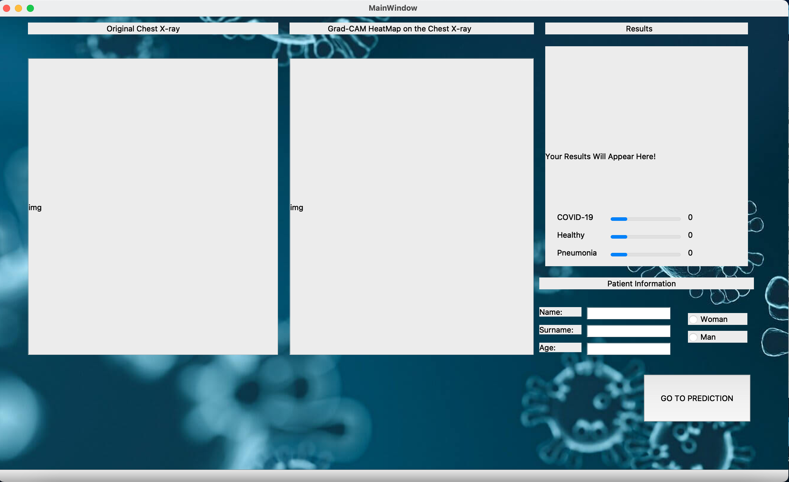

# COVID-19_Detection_Desktop_Application_Software

Please do not forget to save your model as *.h5 and then change the file name with your in the code line. Then the graphical user application
and testing methods will be able to use your own model's weights. There are some illustrations belong to the graphical user interface that
I created. It takes a chest x-ray image from the top left menu and then after filling the meta data, you can click on the GO TO PREDICTION button.
Then you'll see the results on the right hand side box and the Grad-CAM will appear in the middle box.

